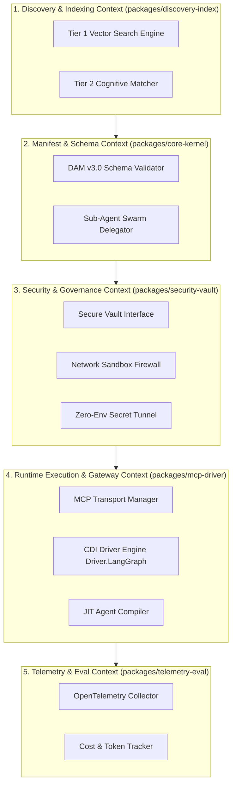

# System Architecture Blueprint: AeroMesh Cognitive Kernel (AMCK)

**Document Version:** 1.0.0 (Authoritative Final Release)  
**Architectural Standard:** Universal Cognitive Protocol (UCP v2.0) & Universal Capability Adapter System (UCR)  
**Target Core Engine:** AeroMesh Cognitive Kernel (`packages/core-kernel` & `packages/aero`)  

---

## 1. High-Level Architectural Vision

The AeroMesh Cognitive Kernel (AMCK) enforces strict architectural decoupling across four operational planes:

1. **Specification & Governance Plane**: Declarative Agent Manifests (DAM v3.0 `agent.json`), JSON Schema assertions (`declarative-agent.schema.json`), and Git-as-a-Registry index (`registry/index.json`).
2. **Cognitive Event Bus (C-Bus)**: An event-sourced, reactive append-only event stream (`CBusStream`) powering real-time visual graph tracing, time-travel step replay, and P2P agent mesh swarms.
3. **Pluggable Cognitive Driver Interface (CDI)**: Framework-agnostic runtime driver abstraction (`Driver.LangGraph`, `Driver.WasmSandbox`, `Driver.NativeAsync`, `Driver.RemoteModel`).
4. **Cognitive Virtual Memory (CVM)**: OS-inspired context page tables managing token limits via LRU page swapping.

```
                         ┌─────────────────────────────────────────┐
                         │          USER INTENT / CLI COMMAND      │
                         └────────────────────┬────────────────────┘
                                              │
                                              ▼
 ┌────────────────────────────────────────────────────────────────────────────────────────┐
 │                        AEROMESH COGNITIVE KERNEL (`packages/core-kernel`)              │
 │                                                                                        │
 │   ┌──────────────────────┐    ┌──────────────────────┐    ┌────────────────────────┐   │
 │   │   Discovery Engine   │    │   Manifest Parser    │    │  Security & Vault      │   │
 │   │ (`discovery-index`)  │───>│  (Schema Asserts)    │───>│   (`security-vault`)   │   │
 │   └──────────────────────┘    └──────────────────────┘    └───────────┬────────────┘   │
 │                                                                       │                │
 │                                                                       ▼                │
 │ ┌────────────────────────────────────────────────────────────────────────────────────┐ │
 │ │                    UNIVERSAL COGNITIVE EVENT BUS (C-BUS)                           │ │
 │ │                    (Event-Sourced Append-Only Event Stream)                        │ │
 │ └──────────────────────────────────────┬─────────────────────────────────────────────┘ │
 │                                        │                                               │
 │                                        ▼                                               │
 │ ┌────────────────────────────────────────────────────────────────────────────────────┐ │
 │ │                    PLUGGABLE COGNITIVE DRIVER INTERFACE (CDI)                      │ │
 │ │                                                                                    │ │
 │ │  ┌──────────────────────┐  ┌──────────────────────┐  ┌──────────────────────────┐  │ │
 │ │  │ Driver.LangGraph     │  │ Driver.WasmSandbox   │  │ Driver.NativeAsync       │  │ │
 │ │  │ (LangGraph Engine)   │  │ (Zero-Trust Edge)    │  │ (Microsecond Microkernel)│  │ │
 │ │  └──────────────────────┘  └──────────────────────┘  └──────────────────────────┘  │ │
 │ └────────────────────────────────────────────────────────────────────────────────────┘ │
 └────────────────────────────────────────────────────────────────────────────────────────┘
```

---

## 2. Bounded Contexts & Domain-Driven Design (DDD)



---

## 3. SOLID Design Principles Mapping

| SOLID Principle | Component / Module | Architectural Implementation |
| :--- | :--- | :--- |
| **Single Responsibility (SRP)** | `ManifestParser` | Exclusively handles JSON validation and hydration. Never executes code or searches indexes. |
| **Open/Closed (OCP)** | `ICognitiveDriver` | Systems extend via pluggable drivers (`Driver.LangGraph`, `Driver.WasmSandbox`) without mutating kernel core. |
| **Liskov Substitution (LSP)** | `ISecureVault` | Any vault implementation (`EnvironmentVault`, `KeyringVault`, `MockVault`) can be swapped transparently. |
| **Interface Segregation (ISP)** | `IManifestIndexRecord` | Exposes lightweight fields (`id`, `tags`, `short_description`) for Tier 1 search without loading full persona prompts. |
| **Dependency Inversion (DIP)** | `IsolatedExecutionEngine` | Depends strictly on abstractions (`ICognitiveDriver`, `ISecureVault`), isolating core from OS process details. |

---

## 4. Gang of Four (GoF) Design Patterns Applied

1. **Strategy Pattern (`IDiscoveryEngine`)**: Swappable search algorithms (Vector Cosine Match vs BM25 Keyword Filter vs Cognitive LLM Evaluator).
2. **Factory Pattern (`ManifestFactory`)**: Instantiates validated `AgentManifest` objects from raw JSON text streams.
3. **Adapter Pattern (`IMcpDriver`)**: Adapts stdio subprocess pipes and SSE HTTP streams into unified tool calls.
4. **Observer / State Machine Pattern (`CBusStream`)**: Reactive C-Bus event stream broadcasting state events.
5. **Proxy / Decorator Pattern (`NetworkSandboxFirewall`)**: Wraps execution to enforce domain allowlisting (`allowed_domains`).

---

## 5. Master Orchestrator & Asynchronous Concurrency Architecture

### 5.1 Unified Master Orchestrator (`AeroMasterOrchestrator`)
The `AeroMasterOrchestrator` service (`packages/aero/src/aero/services/orchestrator.py`) provides a single facade unifying three run modes:
- **Single Agent Mode**: Direct execution via `AeroAgentRunnerService`.
- **DGAP Pipeline Mode**: Contract-validated sequential execution via `DeterministicPipelineOrchestrator`.
- **Mesh Workflow Mode**: Concurrent DAG execution via `AeroWorkflowEngine`.

### 5.2 Non-Blocking Asynchronous Concurrency Engine
`AeroWorkflowEngine.execute_workflow_async` leverages Python `asyncio` event loops and a configurable `ThreadPoolExecutor` worker pool to execute independent steps in parallel without blocking main queues. Dependent steps wait asynchronously (`await completed_events[dep_id].wait()`) for prerequisite steps to complete.
