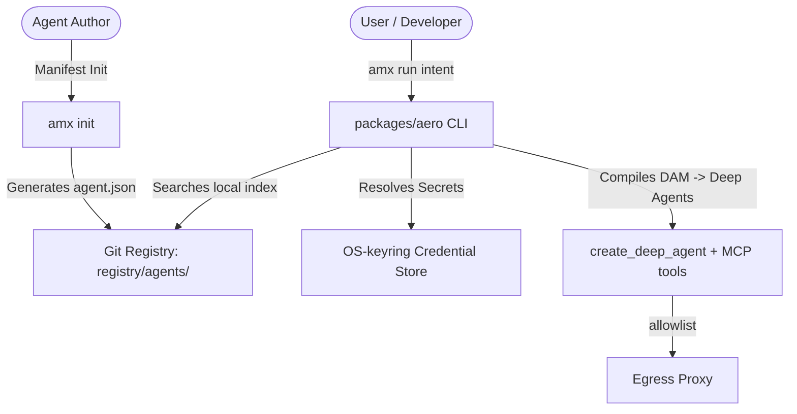

# Ecosystem Integration Topology & Development Roadmap

> **Status: roadmap.** This is the delivery plan. Shipped so far: Phase 1 (core),
> session persistence, real search, live-model CI, and Phase 5 workflows (DWM
> v0.1). The rest is deferred. See `README.md`, `CHANGELOG.md`, and `SECURITY.md`
> for the authoritative current state.

**Document Version:** 1.0.0 (roadmap)  
**Execution Strategy:** 5-Phase Incremental Delivery Plan  
**Status:** Phases 1 & 5 + persistence/search/CI shipped ✅ · Phases 2–4 partial/deferred

---

## 1. Ecosystem Data Contracts & Integration Topology

All shipped modules interact through typed data contracts in `packages/aero`:

---

## 2. 5-Phase Execution Roadmap — honest status

| Phase | Scope | Status |
|---|---|---|
| 1. Standalone `amx` CLI + DAM v0.1 core | CLI, DAM schema/parser, Deep Agents execution, Ed25519 trust + revocation, encrypted vault, egress sandbox | **SHIPPED** ✅ |
| 2. Git-as-registry marketplace + search | `amx share`/`install` (shipped); `amx search` (keyword-only, shipped); hosted marketplace + 2-tier vector index (deferred) | **PARTIAL** |
| 3. Developer tools | VS Code extension (stub `package.json` only); test harness (removed); Sigstore transparency-log bundle (deferred) | **DEFERRED** |
| 4. Multi-language SDKs + session replay | Python SDK (shipped, thin); **session persistence shipped** (SQLite checkpointer/store + `amx history` / `--replay`); TS/Go SDKs (deferred) | **PARTIAL** |
| 5. Workflows + swarm consensus | **Workflows shipped** (`amx workflow`, DWM v0.1 — a signed DAG of verified agents on LangGraph); multi-agent swarms still delegated to Deep Agents subagents | **SHIPPED (workflows)** ✅ |

---

## 3. Verification

- **Offline test suite:** 99 passed (real code; test doubles are confined to
  `tests/conftest.py`).
- **Live-model CI:** shipped — opt-in real DeepSeek tests (`packages/aero/tests_live/`)
  gated on the `DEEPSEEK_API_KEY` GitHub secret.
