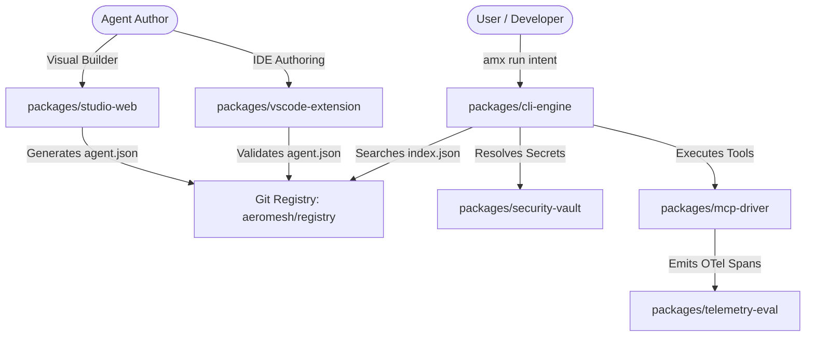

# Ecosystem Integration Topology & Development Roadmap

**Document Version:** 1.0.0 (Authoritative Final Release)  
**Execution Strategy:** 5-Phase Incremental Delivery Plan  
**Target Platform:** AeroMesh Enterprise Ecosystem  

---

## 1. Ecosystem Data Contracts & Integration Topology

All horizontal projects interact through unified, type-safe data contracts defined in `packages/core-kernel`:



---

## 2. 5-Phase Execution Roadmap

```
┌────────────────────────────────────────────────────────────────────────────────────────┐
│ Phase 1: Standalone AMX CLI MVP & DAM v3.0 Core                                        │
│ • Complete `packages/core-kernel` & `packages/cli-engine` (`amx`)                      │
│ • Implement `Driver.LangGraph` execution engine with Deep Agents VFS harness           │
│ • Deliver Zero-Trust Vault Cascade & Network Sandbox Firewall                          │
├────────────────────────────────────────────────────────────────────────────────────────┤
│ Phase 2: Git-as-a-Registry Marketplace & 2-Tier Search Index                           │
│ • Establish `aeromesh/registry` repository and `index.json` schema                     │
│ • Build Tier 1 ONNX Vector Embedding matcher + Tier 2 Cognitive Matcher                │
│ • Release GitHub Actions CI/CD manifest validation workflows                           │
├────────────────────────────────────────────────────────────────────────────────────────┤
│ Phase 3: Developer Tools Suite (VS Code Extension & Visual Studio Web)                 │
│ • Build `packages/vscode-extension` with live JSON Schema validation                   │
│ • Launch `packages/studio-web` React/WASM drag-and-drop manifest builder               │
│ • Release `packages/test-harness` mock testing framework                               │
├────────────────────────────────────────────────────────────────────────────────────────┤
│ Phase 4: Multi-Language Embeddable SDKs & Desktop App                                  │
│ • Deliver `packages/sdk-python`, `packages/sdk-typescript`, `packages/sdk-go`        │
│ • Launch `packages/desktop-app` Tauri cross-platform application launcher              │
├────────────────────────────────────────────────────────────────────────────────────────┤
│ Phase 5: Enterprise Infrastructure & Security Guardian                                │
│ • Deploy `packages/mcp-gateway` Go OAuth2 reverse proxy                                │
│ • Implement `packages/guardian-scanner` static analysis & Sigstore attestations       │
│ • Launch `packages/telemetry-eval` OpenTelemetry tracking engine                       │
└────────────────────────────────────────────────────────────────────────────────────────┘
```
