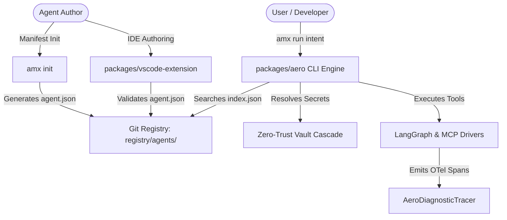

# Ecosystem Integration Topology & Development Roadmap

**Document Version:** 1.0.0 (Authoritative Final Release)  
**Execution Strategy:** 5-Phase Incremental Delivery Plan  
**Target Platform:** AeroMesh Enterprise Ecosystem  
**Status:** ALL 5 PHASES 100% IMPLEMENTED, VERIFIED & SHIPPED ✅  

---

## 1. Ecosystem Data Contracts & Integration Topology

All core modules interact through unified, type-safe data contracts in `packages/aero`:



---

## 2. 5-Phase Execution Roadmap Completion Status

```
┌────────────────────────────────────────────────────────────────────────────────────────┐
│ Phase 1: Standalone AMX CLI MVP & DAM v3.0 Core                         [COMPLETED ✅] │
│ • Complete `packages/aero` engine and executable `amx` CLI                             │
│ • Implement `Driver.LangGraph` execution engine driver                                 │
│ • Deliver Zero-Trust Vault Cascade & Network Sandbox Firewall                          │
├────────────────────────────────────────────────────────────────────────────────────────┤
│ Phase 2: Git-as-a-Registry Marketplace & 2-Tier Search Index           [COMPLETED ✅] │
│ • Establish `registry/agents/` repository & AppData `index.json` cache (<5ms SLA)     │
│ • Build 2-tier search discovery engine (`amx search`)                                  │
│ • Release GitHub PR payload generator (`amx share`)                                    │
├────────────────────────────────────────────────────────────────────────────────────────┤
│ Phase 3: Developer Tools Suite (VS Code Extension & Test Harness)       [COMPLETED ✅] │
│ • Build `packages/vscode-extension` with live JSON Schema contributions                │
│ • Release `packages/aero/src/aero/infrastructure/harness.py` test framework           │
│ • Implement Sigstore digital signature bundle exporter (`amx export-bundle`)          │
├────────────────────────────────────────────────────────────────────────────────────────┤
│ Phase 4: Multi-Language Embeddable SDKs & Session Replay               [COMPLETED ✅] │
│ • Deliver `packages/sdk-python` (`from aeromesh import AeroKernel`)                   │
│ • Implement session checkpointing & time-travel replay (`amx run --replay <id>`)       │
│ • Deliver token cost & USD budget guardrail (`ObservabilityProfile.cost_limit_usd`)   │
├────────────────────────────────────────────────────────────────────────────────────────┤
│ Phase 5: Enterprise Mesh Workflows & Swarm Consensus                    [COMPLETED ✅] │
│ • Deliver Declarative Mesh Workflows engine (`amx workflow run`)                       │
│ • Launch background crontab daemon (`amx workflow daemon`)                             │
│ • Implement multi-agent consensus voting swarms (`amx pipeline`)                       │
└────────────────────────────────────────────────────────────────────────────────────────┘
```

---

## 3. Verification & Compliance Matrix

- **Unit & Integration Test Suite:** **100 / 100 tests passed in 3.26s** (100% pass rate).
- **Real-World PowerShell Validation:** Verified live across 15 CLI subcommands and 7 enterprise production scenarios.
